# @xamidi/github-stats-combinator

This tool combines three scalable vector graphics (SVG) images from three sources

1. `https://github-readme-stats.vercel.app/api?[…stats-query…]`  
   of [@anuraghazra/github-readme-stats](https://github.com/anuraghazra/github-readme-stats)
2. `https://github-readme-stats.vercel.app/api/top-langs?[…languages-query…]`  
   of [@anuraghazra/github-readme-stats](https://github.com/anuraghazra/github-readme-stats)
3. `https://github-profile-trophy.vercel.app/?[…trophies-query…]`  
   of [@ryo-ma/github-profile-trophy](https://github.com/ryo-ma/github-profile-trophy)

via a single query `https://github-stats-combinator.vercel.app/api?[…query…]`, for

```
[…query…] := stats=UrlEncode([…stats-query…])&languages=UrlEncode([…languages-query…])&trophies=UrlEncode([…trophies-query…])
```

where `UrlEncode` maps strings to their [URL-encoded](https://www.urlencoder.org) variant.

For example,

[](https://github.com/xamidi/github-stats-combinator/blob/master/public/sample.svg)

was combined from

1. [https://github-readme-stats.vercel.app/api?[…stats-query…]](https://github-readme-stats.vercel.app/api?username=xamidi&show_icons=true&theme=radical&include_all_commits=true&hide_border=true), for
   ```
   […stats-query…] := username=xamidi&show_icons=true&theme=radical&include_all_commits=true&hide_border=true
   ```
2. [https://github-readme-stats.vercel.app/api/top-langs/?[…languages-query…]](https://github-readme-stats.vercel.app/api/top-langs/?username=xamidi&layout=donut-vertical&theme=radical&langs_count=4&hide_border=true), for
   ```
   […languages-query…] := username=xamidi&layout=donut-vertical&theme=radical&langs_count=4&hide_border=true
   ```
3. [https://github-profile-trophy.vercel.app/?[…trophies-query…]](https://github-profile-trophy.vercel.app/?username=xamidi&theme=radical&column=3&margin-w=9&margin-h=9&title=MultiLanguage,LongTimeUser,Commits), for
   ```
   […trophies-query…] := username=xamidi&theme=radical&column=3&margin-w=9&margin-h=9&title=MultiLanguage,LongTimeUser,Commits
   ```

via [https://github-stats-combinator.vercel.app/api?[…query…]](https://github-stats-combinator.vercel.app/api?stats=username%3Dxamidi%26show_icons%3Dtrue%26theme%3Dradical%26include_all_commits%3Dtrue%26hide_border%3Dtrue&languages=username%3Dxamidi%26layout%3Ddonut-vertical%26theme%3Dradical%26langs_count%3D4%26hide_border%3Dtrue&trophies=username%3Dxamidi%26theme%3Dradical%26column%3D3%26margin-w%3D9%26margin-h%3D9%26title%3DMultiLanguage%2CLongTimeUser%2CCommits), for

```
[…query…] := stats=username%3Dxamidi%26show_icons%3Dtrue%26theme%3Dradical%26include_all_commits%3Dtrue%26hide_border%3Dtrue&languages=username%3Dxamidi%26layout%3Ddonut-vertical%26theme%3Dradical%26langs_count%3D4%26hide_border%3Dtrue&trophies=username%3Dxamidi%26theme%3Dradical%26column%3D3%26margin-w%3D9%26margin-h%3D9%26title%3DMultiLanguage%2CLongTimeUser%2CCommits
```

&nbsp;  
I recommend to request images that fit the predefined container dimensions, such as via

```
column=3&margin-w=9&margin-h=9&title=MultiLanguage,Experience,Commits
```

for `[…trophies-query…]`, and to query the SVG from your `username/username` repository's `README.md` like

```html
<p align="center">

</p>
```

in order to handle cases where the `github-stats-combinator.vercel.app` deployment went into "light sleep" due to inactivity (see [issue #1](https://github.com/xamidi/github-stats-combinator/issues/1)).
